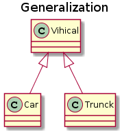
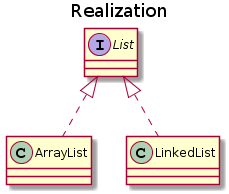
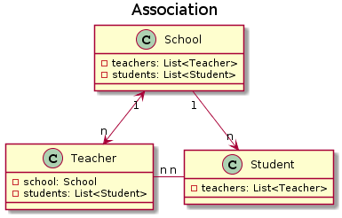
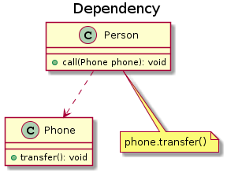


Each pattern describes a **problem** which occurs over and over again in our environment, and then describes the core of the **solution** to that problem, in such a way that you can use this solution a million times over, without ever doing it the same way twice.
--  Christopher Alexander 


# 面向对象编程思想
面向对象程序设计（Object-oriented programming, OOP）是种**具有对象概念的程序编程典范**，同时也是一种程序开发的抽象方针。对象可能包括：
- 字段形式的数据 (data in the form of field)，通常称为属性 (attributes or properties)
- 过程形式的代码 (code in the form of procedures )，通常称为方法/函数 (methods or functions)

对象的典型特性是：对象的方法可以访问并修改与该对象关联的数据。对象有一个 this 或者 self 的概念，用来表示该对象自身。

传统的程序设计主张将程序看作一系列函数的集合，或者直接就是一系列对电脑下达的指令。面向对象程序设计中计算机程序会被设计成彼此相关的对象，其中每一个对象都应该能够接受数据、处理数据并将数据传达给其它对象，因此它们都可以被看作一个小型的“机器”，即对象。

OOP 语言多种多样，但是最受欢迎的语言是**基于类 (class based)** 的，这意味着**对象是类的实例** (objects are instances of classes)，同时类也决定了对象的类型。

许多广泛使用的编程语言（例如 C++，Java，Python 等）是多范例 (multi-paradigm) 的，这意味着他们或多或少地支持面向对象的编程，通常情况下会与命令式，过程式编程结合使用。在使用某门语言中，采用面向对象设计的程序员应当有意识的转变思维到面向对象范式 (OOP paradigm)，其中 Java 是一种重要而纯粹的面向对象语言，Java 语言也强烈建议程序员只进行面向对象的程序开发。

## 三大特性
### 封装 Encapsulation
利用抽象数据类型将数据和基于数据的操作封装在一起，使其构成一个不可分割的独立实体。数据被保护在抽象数据类型的内部，尽可能地隐藏内部的细节，只保留一些对外的接口使其与外部发生联系。用户无需关心对象内部的细节，但可以通过对象对外提供的接口来访问该对象。

优点：
- 减少耦合：可以独立地开发、测试、优化、使用、理解和修改
- 减轻维护的负担：可以更容易被理解，并且在调试的时候可以不影响其他模块
- 有效地调节性能：可以通过剖析来确定哪些模块影响了系统的性能
- 提高软件的可重用性
- 降低了构建大型系统的风险：即使整个系统不可用，但是这些独立的模块却有可能是可用的

### 继承
继承实现了 IS-A 关系，例如 Cat 和 Animal 就是一种 IS-A 关系，因此 Cat 可以继承自 Animal，从而获得 Animal 非 private 的属性和方法。

继承应该遵循里氏替换原则，子类对象必须能够替换掉所有父类对象。Cat 可以当做 Animal 来使用，也就是说可以使用 Animal 引用 Cat 对象。父类引用指向子类对象称为**向上转型**。


Animal animal = new Cat();


### 多态 Polymorphism
多态分为编译时多态和运行时多态：
- 编译时多态主要指方法的重载 (Overload)
- 运行时多态指程序中定义的对象引用所指向的具体类型在运行期间才确定

运行时多态有三个条件：
- 继承
- 覆盖/重写 (Override)
- 向上转型

# 统一建模语言
统一建模语言（Unified Modeling Language，UML）是用来设计软件蓝图的可视化建模语言，1997 年被国际对象管理组织（OMG）采纳为面向对象的建模语言的国际标准。它的特点是简单、统一、图形化、能表达软件设计中的动态与静态信息。

UML 从目标系统的不同角度出发，定义了用例图、类图、对象图、状态图、活动图、时序图、协作图、构件图、部署图等 9 种图。

## 类图
类（Class）是指具有相同属性、方法和关系的对象的抽象，它封装了数据和行为，是面向对象程序设计（OOP）的基础，具有封装性、继承性和多态性等三大特性。

**在 UML 中，类使用包含类名、属性和操作且带有分隔线的矩形来表示**。
- 类名（Name）是一个字符串，例如，Student。
- 属性（Attribute）是指类的特性，即类的成员变量。UML 按以下格式表示：`[可见性]属性名:类型[=默认值]`
- 操作（Operations）是类的任意一个实例对象都可以使用的行为，是类的成员方法。UML 按以下格式表示：`[可见性]名称(参数列表)[:返回类型]`


“可见性”表示该属性对类外的元素是否可见，包括公有（Public）、私有（Private）、受保护（Protected）和朋友（Friendly）4 种，在类图中分别用符号+、-、#、~表示。


除了常规类，还有一些特殊的类常常用于面向对象编程语言中，包括：接口、抽象类等。类图（ClassDiagram）是用来显示系统中的类、接口、协作以及它们之间的静态结构和关系的一种静态模型。不同的编程语言有不同的模型，Java 中主要使用的类图如下。

## 类间关系
在软件系统中，类不是孤立存在的，类与类之间存在各种关系。根据类与类之间的耦合度从弱到强排列，UML 中的类图有以下几种关系：依赖关系、关联关系、聚合关系、组合关系、泛化关系和实现关系。其中泛化和实现的耦合度相等，它们是最强的。

关系|耦合度|代码形式|关系
:---:|:---:|:---:|:---:
泛化 (Generalization)|⭐⭐⭐⭐⭐|继承|is-a
实现 (Realization)|⭐⭐⭐⭐⭐|接口与实现|like-a
组合 (Composition)|⭐⭐⭐⭐|成员变量|contains-a
聚合 (Aggregation)|⭐⭐⭐|成员变量|has-a
关联 (Association)|⭐⭐|成员变量|/
依赖 (Dependency)|⭐|方法的参数、局部变量|use-a


**一般关联 vs 聚合 vs 组合**：三者都是广义上的关联关系，但逻辑上拥有不同的耦合度，即：`组合 > 聚合 > 关联`。不过从代码的角度看都是**成员变量**的表示形式。三者均可以表示为 A 类的成员变量保存了关联 B 类的一个引用。


### 泛化 (Generalization)
泛化 (Generalization) 表示一般与特殊的关系，是父类与子类之间的关系，是一种**继承**关系，是 is-a 的关系。

在 UML 类图中泛化使用**带三角箭头的实线**表示，从具体类指向泛化类。

### 实现 (Realization)
实现 (Realization) 表示接口与实现类之间的关系。类实现了接口，类中的操作实现了接口中所声明的所有的抽象操作，是 like-a 的关系。

在 UML 类图中使用**带三角箭头的虚线**表示，从实现类指向抽象类。

### 关联 (Association)
关联（Association）关系是对象之间的一种引用关系，用于表示一类对象与另一类对象之间的联系。这是一种静态关系，与运行过程的状态无关，在最开始就可以确定。因此也可以用 1 对 1、多对 1、多对多这种关联关系来表示。

在 UML 类图中关联分为：
- 单向关联：使用**带箭头的实线**表示，箭头指向关联类；
- 双向关联：使用**带双箭头或不带箭头的实线**表示。

### 聚合 (Aggregation)
聚合（Aggregation）关系是关联关系的一种，是强关联关系，是整体和部分之间的关系，但整体不存在了部分还是可以存在的，是 has-a 的关系。

在 UML 类图中使用带**空心菱形**的实线表示，菱形指向整体。

### 组合 (Composition)
组合关系是关联关系的一种，也表示类之间的整体与部分的关系，但它是一种**更强烈的聚合关系**，但是和聚合关系不同的是，组合关系中的整体不存在了，部分也就不存在了，是 contains-a 关系。

在 UML 类图中使用带**实心菱形**的实线表示，菱形指向整体。

### 依赖 (Dependency)
依赖（Dependency）关系是一种使用关系，它是对象之间耦合度最弱的一种关联方式，是临时性的关联。A 类和 B 类是依赖关系（B --> A）主要有三种形式：
- A 类是 B 类方法的局部变量；
- A 类是 B 类方法的参数；
- A 类向 B 类发送消息，从而影响 B 类发生变化。

在 UML 类图中**带箭头的虚线**表示，从使用类指向被依赖的类。

# 设计原则

## S.O.L.I.D
简写|全拼|中文翻译|一句话解释
---|---|---|---
SRP|The Single Responsibility Principle|单一责任原则|一个类只负责一件事
OCP|The Open Closed Principle|开放封闭原则|类应该对扩展开放，对修改关闭。
LSP|The Liskov Substitution Principle|里氏替换原则|子类对象必须能够替换掉所有父类对象。
ISP|The Interface Segregation Principle|接口分离原则|使用多个专用接口比使用单一的总接口要好。
DIP|The Dependency Inversion Principle|依赖倒置原则|高层模块不应该依赖于低层模块，二者都应该依赖于抽象；抽象不应该依赖于细节，细节应该依赖于抽象。

## 其他原则

简写|全拼|中文翻译|一句话解释
---|---|---|---
LKP|Least Knowledge Principle|最少了解原则|一个对象应当对其他对象有尽可能少的了解，不和陌生人说话。
CRP|The Composite Reuse Principle|组合复用原则|**尽量使用对象组合，而不是通过继承来达到复用的目的**。
SAP|The Stable Abstractions Principle|稳定抽象原则|最稳定的包应该是最抽象的包，不稳定的包应该是具体的包，即包的抽象程度跟它的稳定性成正比。
SDP|The Stable Dependencies Principle|稳定依赖原则|之间的依赖关系都应该是稳定方向依赖的，包要依赖的包要比自己更具有稳定性。

# 设计模式
> Each pattern describes a **problem** which occurs over and over again in our environment, and then describes the core of the **solution** to that problem, in such a way that you can use this solution a million times over, without ever doing it the same way twice.
--  Christopher Alexander 

## 创建型
设计模式|目的
---|---|---
[单例 (Singleton)](/2019/03/28/design-patterns/#singleton)|确保一个类只有一个实例，并提供该实例的全局访问点。
[简单工厂 (Simple Factory)](/2019/03/28/design-patterns/#simple-factory)|封装创建对象时的内部细节，并为客户提供一个创建对象的通用接口。
[工厂方法（Factory Method）](/2019/03/28/design-patterns/#factory-method)|提供一个创建对象的接口，但由工厂子类决定要实例化哪个类。
[抽象工厂 (Abstract Factory)](/2019/03/28/design-patterns/#abstract-factory)|提供一个接口，用于创建**相关的对象家族**。
[构造器 (Builder)](/2019/03/28/design-patterns/#builder)|封装一个对象的构造过程，并允许按步骤构造。
[原型模式 (Prototype)](/2019/03/28/design-patterns/#prototype)|使用原型实例指定要创建对象的类型，通过复制这个原型来创建新对象。

## 行为型
设计模式|目的
---|---|---
[责任链 (Chain of Responsibility)](/2019/03/28/design-patterns/#chain-of-responsibility)|使多个对象都有机会处理请求，从而避免请求的发送者和接收者之间的耦合关系。将这些对象连成一条链，并沿着这条链发送该请求，直到有一个对象处理它为止。
过滤器||

## 结构型
设计模式|目的|
---|---|---
[适配器 (Adapter)](/2019/03/28/design-patterns/#adapter)|把一个类接口转换成另一个用户需要的接口。
[桥接 (Bridge)](/2019/03/28/design-patterns/#bridge)|将抽象与实现分离开来，使它们可以独立变化。
[组合 (Composite)](/2019/03/28/design-patterns/#composite)|将对象组合成树形结构来表示“整体/部分”层次关系。
[装饰器 (Decorator)](/2019/03/28/design-patterns/#decorator)|为对象动态添加功能.
[外观 (Facade)](/2019/03/28/design-patterns/#facade)|提供了一个统一的接口，用来访问子系统中的一群接口，从而让子系统更容易使用。
[享元 (Flyweight)](/2019/03/28/design-patterns/#flyweight)|利用共享的方式来支持大量细粒度的对象，这些对象一部分内部状态是相同的。
[代理 (Proxy)](/2019/03/28/design-patterns/#proxy)|控制对其它对象的访问。

# 参考
- https://www.oodesign.com/singleton-pattern.html
- https://www.planttext.com/
- https://www.oodesign.com/
- https://cyc2018.github.io/CS-Notes/#/README
- GoF